# ICBCQuestions
## Question 0
### Q:
To identify hazards in your surroundings while driving, you should
### IMG:

### A:
scan the driving environment regularly
## Question 1
### Q:
On a vehicle with AUTOMATIC transmission, when should the first and second DRIVE (D1, D2) gears be used
### IMG:

### A:
when pulling heavy loads or when going up or down very steep hills.
## Question 2
### Q:
Which of the following is NOT part of the pre-trip check you should do EVERY time you drive?
### IMG:

### A:
Check radiator fluid and oil levels.
## Question 3
### Q:
Seat belts are most effective in preventing injury when
### IMG:

### A:
the lap belt and shoulder strap are worn correctly.
## Question 4
### Q:
As a driver you should
### IMG:

### A:
constantly check the sides of the road and all of your mirrors, as well as the road ahead
## Question 5
### Q:
When making a right turn, you should shoulder check to
### IMG:

### A:
make sure a cyclist or other road user is not beside you
## Question 6
### Q:
The correct See-Think-Do strategy for the driver of Car A is?
### IMG:
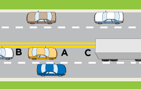
### A:
Sees that Car B is close behind; thinks, "I need more space.";  slows and  gradually leaves a bigger cushion in front.
## Question 7
### Q:
When do you NOT need to make a shoulder check?
### IMG:

### A:
When judging your following distance.
## Question 8
### Q:
There is a vehicle directly in the blind spot of Car A, which one is it?
### IMG:
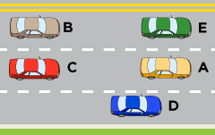
### A:
Car D
## Question 9
### Q:
The best way to check for vehicles in the blind spots is by
### IMG:

### A:
looking over your shoulder
## Question 10
### Q:
Reaction time is affected most after
### IMG:

### A:
drinking alcohol
## Question 11
### Q:
What is this cyclist going to do?
### IMG:
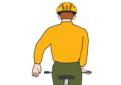
### A:
Stop or slow down.
## Question 12
### Q:
A driver should not change lanes
### IMG:

### A:
in intersections
## Question 13
### Q:
Unless otherwise posted, the speed limit WITHIN cities and towns is
### IMG:

### A:
50km/h
## Question 14
### Q:
What should the driver of Car A do?
### IMG:
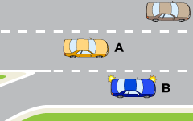
### A:
Slow down to allow Car B safe entry.
## Question 15
### Q:
Before you pull out to pass, you should
### IMG:

### A:
be able to see well ahead
## Question 16
### Q:
You should NOT pass another vehicle
### IMG:

### A:
when your vision is obstructed
## Question 17
### Q:
It is illegal to exceed the posted speed limit
### IMG:

### A:
at all times
## Question 18
### Q:
If you are behind a large vehicle or a motorcycle on a high speed road, your following distance should be at LEAST
### IMG:

### A:
3 seconds
## Question 19
### Q:
In bad weather or slippery conditions on high speed roads, your following distance should be at LEAST
### IMG:

### A:
4 seconds
## Question 20
### Q:
Pedestrians and cyclists are most at risk from vehicles because
### IMG:

### A:
they are more likely to be severely injured in a crash than car drivers and passengers
## Question 21
### Q:
What is the most immediate danger to Cyclist A?
### IMG:
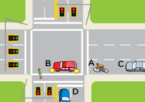
### A:
The driver of Car B may not see Cyclist A and turn into its path.
## Question 22
### Q:
You MUST stop for a school bus
### IMG:

### A:
when its red lights are flashing
## Question 23
### Q:
If you see pedestrians at the side of the road and wanting to jaywalk you should
### IMG:

### A:
slow down and be ready to stop
## Question 24
### Q:
Pedestrians with a white cane should be treated with extra care because
### IMG:

### A:
they might be uncertain when crossing a street
## Question 25
### Q:
Which car does NOT have an escape route if a problem occurs ahead?
### IMG:
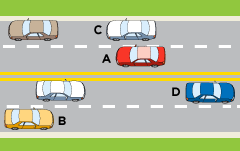
### A:
Car A
## Question 26
### Q:
Car A
### IMG:
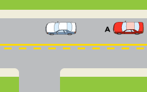
### A:
may not pass
## Question 27
### Q:
This sign means
### IMG:
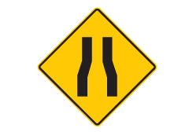
### A:
road narrows ahead
## Question 28
### Q:
Making eye contact with cyclists around your vehicle
### IMG:

### A:
is a good means of communication
## Question 29
### Q:
If you notice a driver who is steering side to side or stopping without reason, you should
### IMG:

### A:
give yourself extra space
## Question 30
### Q:
Stopped public transit buses
### IMG:

### A:
may hide pedestrians who are preparing to cross
## Question 31
### Q:
When pulling out of a driveway on to a street with a sidewalk, what must the driver of Car A do before entering the street?
### IMG:
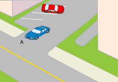
### A:
stop before the sidewalk
## Question 32
### Q:
Your space margins are the distance between
### IMG:

### A:
your vehicle and other road users
## Question 33
### Q:
One danger of driving too close to the car in front of you is
### IMG:

### A:
you may not be able to see what is up ahead
## Question 34
### Q:
Drivers should give cyclists extra room because they
### IMG:

### A:
might swerve or change lanes
## Question 35
### Q:
This car may
### IMG:

### A:
not pass but can turn left over the line
## Question 36
### Q:
You should never sneak behind a truck when it is backing up because
### IMG:

### A:
it is dangerous if you enter one of its blind spots
## Question 37
### Q:
You are driving along a multi-lane one way street. You see an emergency vehicle with lights flashing in your rear view mirror.  You should
### IMG:

### A:
move safely to either side of the road and stop
## Question 38
### Q:
The traffic light for Car A has just turned green.  An ambulance with flashing lights is coming up from behind.  What should Car A do?
### IMG:
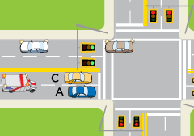
### A:
Turn right to clear a path for the ambulance.
## Question 39
### Q:
You are driving in the LEFT lane of a DIVIDED highway.  You see an emergency vehicle with lights flashing in your rear view mirror.  You should
### IMG:

### A:
move safely to the nearest edge of the road and stop
## Question 40
### Q:
To make a left turn at this intersection, Vehicle A should
### IMG:
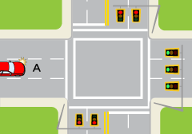
### A:
move to the left lane before turning
## Question 41
### Q:
After you have stopped at a steady red light, you may
### IMG:

### A:
turn right or turn left into a one-way street if it is safe and no signs prohibit it
## Question 42
### Q:
What should you be prepared to do when being passed on a two lane road?
### IMG:

### A:
slow down and make room so that they may safely pass
## Question 43
### Q:
What should the driver of Car A do?
### IMG:
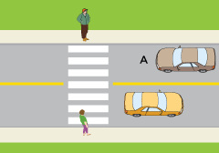
### A:
Slow down and stop.
## Question 44
### Q:
In this traffic circle, the driver of Vehicle A wants to head down Street B.  The correct path is
### IMG:
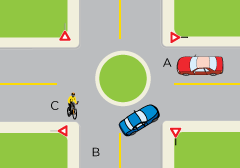
### A:
to yield to traffic in the circle, turn right when safe, and exit right down Path B
## Question 45
### Q:
Car A and Car B arrived at the stop sign at the same time.  Who should go first?
### IMG:
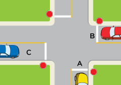
### A:
Car B.
## Question 46
### Q:
Car B arrived at the stop sign first.  Who should go first?
### IMG:
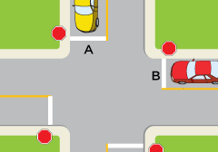
### A:
Car B.
## Question 47
### Q:
You are the driver of Car A  and want to make a right turn.  Which is the best See-Think-Do manoeuvre?
### IMG:
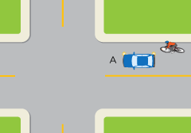
### A:
I see cyclist B approaching; I think, "The cyclist may be at the corner when I want to turn."; I slow down.
## Question 48
### Q:
The traffic signal has just turned yellow.  There are no other vehicles around.  Vehicle A should
### IMG:
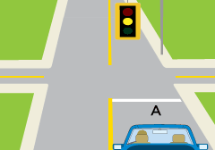
### A:
slow down and stop since it is safe to do so
## Question 49
### Q:
Hand signals
### IMG:

### A:
should be used if turn signals are hard to see
## Question 50
### Q:
Before making a left turn, a driver should
### IMG:

### A:
yield to oncoming traffic and wait for a safe gap
## Question 51
### Q:
When you see a solid white line on your left it means
### IMG:

### A:
you may not changes lanes
## Question 52
### Q:
The driver of Car A should
### IMG:
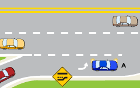
### A:
enter freeway at the speed of  traffic flow
## Question 53
### Q:
In the ACCELERATION lane before merging on to a highway, a driver should
### IMG:

### A:
speed up to match the speed of traffic.
## Question 54
### Q:
When exiting a highway you should slow down
### IMG:

### A:
after you are in the exit lane.
## Question 55
### Q:
This sign tells you
### IMG:
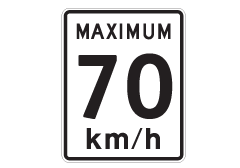
### A:
the fastest you may drive under ideal conditions
## Question 56
### Q:
This sign means:
### IMG:
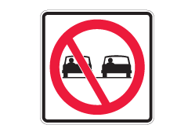
### A:
do not pass
## Question 57
### Q:
This sign warns,
### IMG:
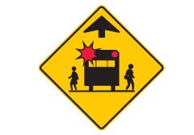
### A:
a school bus stop is ahead
## Question 58
### Q:
This sign means that in this lane, you must
### IMG:
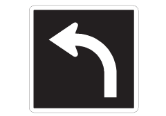
### A:
turn left only
## Question 59
### Q:
This sign, without a speed tab below, means
### IMG:
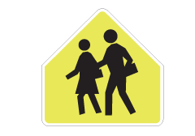
### A:
school zone - reduce speed when children are present
## Question 60
### Q:
Although environmental elements such as rain or ice contribute to skidding, the main cause of skidding is
### IMG:

### A:
poor driving skills
## Question 61
### Q:
This sign means
### IMG:
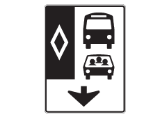
### A:
only buses and high occupancy vehicles in this lane
## Question 62
### Q:
This sign means
### IMG:
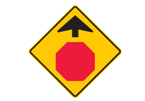
### A:
stop sign ahead
## Question 63
### Q:
What is the correct response if your car starts to skid?
### IMG:

### A:
ease off the accelerator and steer in the direction you want to go.
## Question 64
### Q:
This sign warns
### IMG:
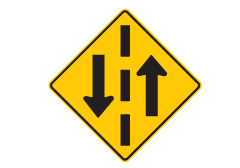
### A:
two-way traffic ahead
## Question 65
### Q:
This sign means
### IMG:
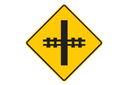
### A:
railway crossing ahead - be prepared to stop
## Question 66
### Q:
This sign means:
### IMG:
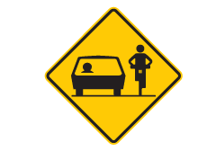
### A:
cyclists may be on roadway
## Question 67
### Q:
This sign means
### IMG:
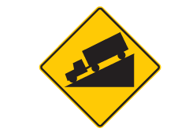
### A:
steep hill ahead - slow or gear down
## Question 68
### Q:
This sign means
### IMG:
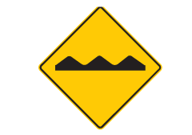
### A:
Bump or rough road ahead; slow down.
## Question 69
### Q:
This sign means
### IMG:
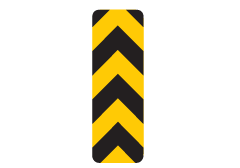
### A:
obstruction - keep right or left
## Question 70
### Q:
This sign means
### IMG:
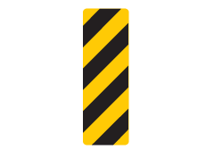
### A:
obstruction - keep left
## Question 71
### Q:
This sign means
### IMG:
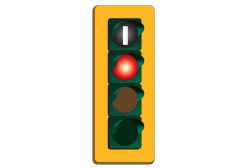
### A:
only buses may go on this signal
## Question 72
### Q:
This signal over a lane means
### IMG:
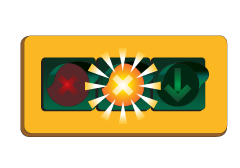
### A:
move out of this lane and into the lane with the green arrow
## Question 73
### Q:
This sign means:
### IMG:
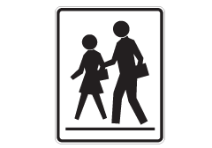
### A:
school crosswalk, yield to pedestrians;  if there is a crossing guard follow directions
## Question 74
### Q:
If you get angry or upset before driving, you should
### IMG:

### A:
calm down before you drive
## Question 75
### Q:
A common cause of driver anger and frustration is
### IMG:

### A:
being impatient with the driving environment
## Question 76
### Q:
Which of the following is NOT a good way to identify your driving attitude?
### IMG:

### A:
Blaming all driving errors on others.
## Question 77
### Q:
Which of the following is MOST likely to make other drivers aggressive?
### IMG:

### A:
Not pulling over when a line of traffic has formed behind you.
## Question 78
### Q:
When other drivers honk horns or yell at you,
### IMG:

### A:
assess the situation and rely on your own knowledge of safe driving practices
## Question 79
### Q:
If you don't know what other drivers are going to do,
### IMG:

### A:
yield the right of way to be safe
## Question 80
### Q:
If you feel sleepy while driving you should,
### IMG:

### A:
stop somewhere safe, lock your doors,  and nap
## Question 81
### Q:
What factor is involved in over 30% of crash fatalities yearly in British Columbia?
### IMG:

### A:
Alcohol.
## Question 82
### Q:
If you are going into a curve at high speed, why is taking your foot off the accelerator a good idea before the curve?
### IMG:

### A:
it is a good strategy to help slow you down without using your brakes in the curve.
## Question 83
### Q:
Inertia is
### IMG:

### A:
the tendency for moving objects to continue moving forward in a straight line
## Question 84
### Q:
If you go around a curve too quickly, inertia may cause your vehicle to
### IMG:

### A:
stay in a straight line and go off the road
## Question 85
### Q:
Which of the following is NOT likely to contribute to a vehicle skidding?
### IMG:

### A:
Driving at a speed suitable to the road conditions
## Question 86
### Q:
Anti-lock braking systems (ABS) are different from regular brakes.  Emergency braking with ABS involves
### IMG:

### A:
squeezing the brakes and holding them on, until you come to a complete stop
## Question 87
### Q:
If a vehicle has a standard transmission, coasting down a hill with the clutch pushed "IN"
### IMG:

### A:
is unsafe and illegal
## Question 88
### Q:
The beginning of a rainfall may cause roads to be particularly slippery because
### IMG:

### A:
the water mixes with oil on the road
## Question 89
### Q:
Hydroplaning occurs
### IMG:

### A:
when your tires float on a film of water and lose traction with the road
## Question 90
### Q:
Which of these is NOT a good strategy for night driving?
### IMG:

### A:
Staying closer to the car ahead so you can see their tail lights more clearly.
## Question 91
### Q:
When driving in bad weather, you should make your vehicle easier for others to see by
### IMG:

### A:
turning on the low beam headlights
## Question 92
### Q:
If your vehicle breaks down on a busy highway you should NOT
### IMG:

### A:
try to do roadside repairs on your vehicle
## Question 93
### Q:
Letting up on the brake just before hitting a large animal that you can't avoid
### IMG:

### A:
lessens the chance of it going through the windshield
## Question 94
### Q:
You are in Car A and there is a large truck opposite you in the intersection that is also turning.  Where will it be hardest for you to see any hazards?
### IMG:
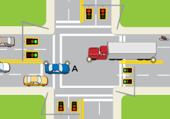
### A:
Behind and to the right of the truck
## Question 95
### Q:
Before you back up, you check your mirrors and do a 360-degree vision check to look for hazards.  While backing up,
### IMG:

### A:
Turn and look through the rear window.
## Question 96
### Q:
To maintain proper road (lane) position and to steer your vehicle in smooth line, you should
### IMG:

### A:
look well ahead in the direction you want to go.
## Question 97
### Q:
If a line of vehicles has formed behind you and you are driving below the speed limit, why is it a good idea to (safely) pull over to let them pass?
### IMG:

### A:
Other drivers behind you may become frustrated and angry and decide to unsafely drive around you
## Question 98
### Q:
In what driving conditions would you use the two second rule for establishing a safe following distance between your vehicle and the vehicle in front of you?
### IMG:

### A:
Ideal weather conditions and on lower speed roads such as in a city.
## Question 99
### Q:
You are approaching an intersection with no signs or painted crosswalks.  Someone has just stepped off the curb at the intersection to cross the street.  You must,
### IMG:

### A:
Yield and be prepared to stop to let them safely cross.
## Question 100
### Q:
It is 6pm and there is a school patrol at a crosswalk holding up a stop sign.  You can see no children around.  What should you do?
### IMG:
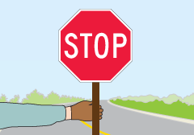
### A:
Obey the school patrol and stop.
## Question 101
### Q:
If a pedestrian is crossing the street with a guide dog, a driver should
### IMG:

### A:
Give them extra room as they may be uncertain about where traffic is in relation to them.
## Question 102
### Q:
Cyclists may swerve to the left and right while on a road as they need to avoid hazards or deal with windy conditions.  What is a good practice when passing a cyclist?
### IMG:
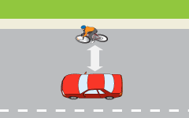
### A:
Leave them as much space as possible.
## Question 103
### Q:
What is this cyclist going to do?
### IMG:
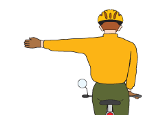
### A:
turn left
## Question 104
### Q:
How much space should you leave beside you while passing a cyclist?
### IMG:

### A:
Allow as much as is safely possible. One metre or more.
## Question 105
### Q:
A truck and trailer driving beside you on your right hand side is about to turn right.  What hazard should you watch out for most?
### IMG:
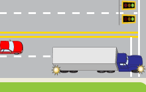
### A:
The truck may swing wide into your lane as it needs space to clear the curb. Slow down and be cautious.
## Question 106
### Q:
You are stopped for a school bus that has its red lights flashing.  When may you proceed?
### IMG:
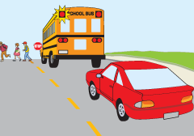
### A:
You must wait until the lights have stopped flashing. If the bus has a swing-out stop sign, it must also be pulled in.
## Question 107
### Q:
When are you required to yield to a public transit bus that has a yield sign on the back and is signaling to enter traffic?
### IMG:
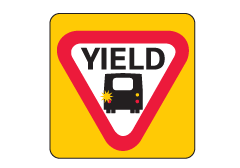
### A:
on all roads where the speed limit is 60km/h or lower
## Question 108
### Q:
Why is increasing the space margin between you and a car in front of your vehicle a good idea when being tailgated?
### IMG:
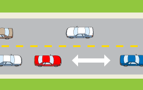
### A:
you can stop more gradually if the car in front suddenly brakes or a hazard appears, reducing the chance of the tailgater crashing into you.
## Question 109
### Q:
When following a fire truck, how far back must you be?
### IMG:

### A:
150 metres
## Question 110
### Q:
There are many collisions between cars and trains at night because
### IMG:
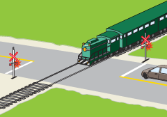
### A:
The side of a train already crossing the road can be difficult to see at night and the car driver does not see the train.
## Question 111
### Q:
What are the only colours of flashing lights you will find at a railroad crossing?
### IMG:

### A:
Red.
## Question 112
### Q:
Do you have to stop at intersections with no lights or stop signs (i.e. an uncontrolled intersection)?
### IMG:
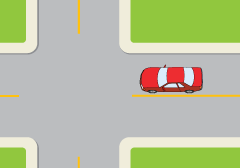
### A:
no, but you should slow down and be prepared to yield to other road users
## Question 113
### Q:
You see ahead of you that a traffic light has been green for a long time.  What should you do?
### IMG:
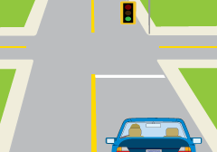
### A:
you should be ready for this stale green light to change.  Be prepared to stop if necessary.
## Question 114
### Q:
You are stopped at a railway crossing where there are flashing lights and bells.  When are you allowed to proceed?
### IMG:

### A:
you must remain stopped until it is safe to cross
## Question 115
### Q:
If you are driving slowly and a line of cars forms behind you should,
### IMG:

### A:
pull over and stop to let other drivers go by.
## Question 116
### Q:
In good weather in the city, your minimum following distance should be at LEAST
### IMG:

### A:
2 seconds
## Question 117
### Q:
If you are behind a vehicle on an unpaved road, your minimum following distance should be at LEAST
### IMG:

### A:
3 seconds
## Question 118
### Q:
What are these cyclists signaling to do?
### IMG:
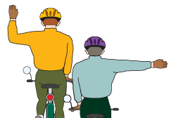
### A:
Turn right.
## Question 119
### Q:
This sign on a transit bus when it is signalling to enter traffic means
### IMG:

### A:
you must yield to them where the speed limit is 60 km/h or lower.
## Question 120
### Q:
You are in busy traffic and someone is driving too closely behind you. Which of the following actions will help protect you?
### IMG:

### A:
Gradually increase the space between you and the vehicle in front of you.
## Question 121
### Q:
When will you see green lights flashing at a railway crossing?
### IMG:

### A:
There are no flashing green lights at a railway crossing.
## Question 122
### Q:
Do you stop at an uncontrolled intersection?
### IMG:

### A:
You only need to slow down and look out for other road users.
## Question 123
### Q:
Before entering from a side street or alley must the driver of Car A stop before the sidewalk?
### IMG:
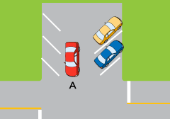
### A:
Yes, you must always stop before crossing a sidewalk out of an alleyway or side street.
## Question 124
### Q:
When the solid line of a double yellow line is on your side
### IMG:
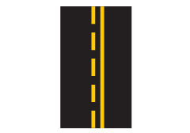
### A:
you may not pass.
## Question 125
### Q:
When the solid line of a double yellow line is on your side, are you allowed to make a left turn?
### IMG:

### A:
Yes as long as you are not impeding other traffic.
## Question 126
### Q:
A vehicle skidding is most likely caused by
### IMG:

### A:
poor driving skills.
## Question 127
### Q:
If driving on a slippery road would you drive at the posted speed limit?
### IMG:

### A:
I can decide to choose a reduced speed that is safe or increase my following distance with other vehicles to avoid skidding.
## Question 128
### Q:
Which of the following is NOT something you should do while merging on to a highway?
### IMG:

### A:
Stop and wait for a gap.
## Question 129
### Q:
Unless otherwise posted, the speed limit OUTSIDE of cities and towns is
### IMG:

### A:
80 km/h
## Question 130
### Q:
A driver should honk their horn at a cyclist
### IMG:

### A:
as a suitable warning.
## Question 131
### Q:
You are on a narrow road and want to pass a cyclist, you should
### IMG:

### A:
wait for a clear, straight stretch that will allow you to pull out and give the cyclist plenty of room as you pass.
## Question 132
### Q:
In heavy traffic, how can you help a cyclist who may want to change lanes and turn left at an intersection?
### IMG:

### A:
Leave extra room so the cyclist can safely change lanes.
## Question 133
### Q:
A steady yellow light means:
### IMG:
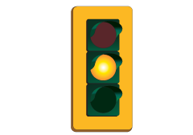
### A:
stop unless it is unsafe to do so.
## Question 134
### Q:
Vehicles at a four-way stop intersection must yield to the vehicle on their right UNLESS:
### IMG:

### A:
another vehicle comes to a complete stop before them.
## Question 135
### Q:
If two vehicles arrive at a 4-way stop intersection at the same time and are facing each other
### IMG:

### A:
a vehicle that is going straight through may go first.
## Question 136
### Q:
You have passed the acceleration area and are ready to merge. You should first:
### IMG:

### A:
look to your left and behind for a safe gap.
## Question 137
### Q:
Why is it important to come to a complete stop for a yellow light when possible?
### IMG:

### A:
All of these.
## Question 138
### Q:
One way in which a passenger can help the driver to drive safely is by
### IMG:

### A:
avoiding conversations that could distract the driver.
## Question 139
### Q:
When other drivers act aggressively towards you, it’s best to
### IMG:

### A:
avoid eye contact and give the other driver plenty of room.
## Question 140
### Q:
The vehicle on the right is at more risk of losing traction around a curve because
### IMG:

### A:
it has a higher centre of gravity than the vehicle on the left.
## Question 141
### Q:
You’re driving around a curve and you start to lose traction. What should you do?
### IMG:

### A:
Ease off the accelerator and re-apply gently when you regain traction.
## Question 142
### Q:
You’re driving with your high beam headlights on and a car is approaching. You must dim them when the approaching car is within
### IMG:

### A:
150 metres.
## Question 143
### Q:
Headlights must be used
### IMG:

### A:
from 30 minutes after sunset until 30 minutes before sunrise.
## Question 144
### Q:
Which of the following should you NOT do after being involved in a crash?
### IMG:

### A:
Discuss who is at fault for the crash.
## Question 145
### Q:
The MINIMUM safe following distance of two seconds behind the car ahead of you is
### IMG:

### A:
for ideal conditions in the city.
## Question 146
### Q:
At intersections with no lights or stop signs, you should
### IMG:

### A:
slow down, cover the brake pedal and look both ways as you near the intersection.
## Question 147
### Q:
What signal at an intersection would be treated the same as a stop sign?
### IMG:

### A:
A flashing red light.
## Question 148
### Q:
Are you allowed to use hands-free 'voice to text' features on your phone while operating a vehicle if you have your learner's (L) or novice (N) licence?
### IMG:

### A:
You are not allowed to operate hands-free electronic devices at any time while driving.
## Question 149
### Q:
While operating a vehicle, if you have your learner’s (L) or novice licence (N) are you allowed to use hands free ‘voice to text’ on your phone while driving?
### IMG:

### A:
You are not allowed to operate hands-free electronic devices at any time while driving.
## Question 150
### Q:
When approaching stopped emergency vehicles displaying flashing lights you must
### IMG:

### A:
slow down and change lanes if traffic permits.
## Question 151
### Q:
When approaching a stopped emergency vehicle with flashing lights on highways with speed limits of 80 km/h or over, in addition to changing lanes, you must slow to
### IMG:

### A:
70 km/h.
## Question 152
### Q:
When approaching a stopped emergency vehicle with flashing lights on highways with speed limits of under 80 km/h, in addition to changing lanes, you must slow to
### IMG:

### A:
40 km/h.
## Question 153
### Q:
Space margins include being able to quickly move into another lane to avoid hazards.  Which vehicle does NOT have a space margin to change lanes?
### IMG:

### A:
Car B
## Question 154
### Q:
This sign means:
### IMG:

### A:
Two-way left turn lane.
## Question 155
### Q:
This sign means:
### IMG:

### A:
No turns permitted at this intersection.
## Question 156
### Q:
This sign means slow to 30 km/h:
### IMG:

### A:
Every day from dawn to dusk.
## Question 157
### Q:
This sign means:
### IMG:

### A:
Playground nearby - drive with caution.
## Question 158
### Q:
A steady green arrow means:
### IMG:

### A:
You may turn in the direction of the arrow if the intersection is clear.
## Question 159
### Q:
A steady red light means:
### IMG:

### A:
Stop. After coming to a full stop you may turn right or turn left onto a one-way street unless a sign forbids it.
## Question 160
### Q:
A flashing red light means:
### IMG:

### A:
Stop and proceed when it is safe to do so.
## Question 161
### Q:
A flashing yellow traffic light means:
### IMG:

### A:
Slow down and be prepared to stop.
## Question 162
### Q:
If you are in the Graduated Licensing Program (GLP), are you allowed to use a GPS navigation device while driving?
### IMG:

### A:
No, using a GPS as an electronic device can be a distraction.
## Question 163
### Q:
While driving, a hand held device may be used to…
### IMG:

### A:
none of these are allowed.
## Question 164
### Q:
I am allowed to check text messages in my vehicle…
### IMG:

### A:
when the vehicle is safely parked off the roadway.
## Question 165
### Q:
As a Class 7 L or N driver, I am allowed to use my hands free device while driving…
### IMG:

### A:
for emergency calls only.
## Question 166
### Q:
You're driving at the speed limit in the left lane of an 80km/h multi-lane highway. A car approaches from behind. You must:
### IMG:

### A:
safely pull into to nearest lane on your right to let the other vehicle pass.
## Question 167
### Q:
You're driving 90km/h in the left lane of a multi-lane highway in a rural area. Must you move over to the right?
### IMG:

### A:
Unless any vehicle approaches from behind, you may stay in the left lane to keep a greater distance from any wildlife on the road.
## Question 168
### Q:
Can I listen to music from my electronic device while driving?
### IMG:

### A:
Yes, you can listen to music from an electronic device while driving, provided that it is connected to the in-vehicle audio system, and you don't touch any electronic devices while 
operating the vehicle.
## Question 169
### Q:
Which of the following would not qualify as an emergency call that I can make while driving?
### IMG:

### A:
To a family member
## Question 170
### Q:
When can I use a personal electronic device if I'm in the Graduated Licensing Program (GLP)?
### IMG:

### A:
None of the above - I cannot use a personal electronic device in the GLP
## Question 171
### Q:
If I am at a red light or stopped in traffic, can I look at a text I just received?
### IMG:

### A:
No, you may not operate your cell phone while on the road including when you're stopped in traffic.
